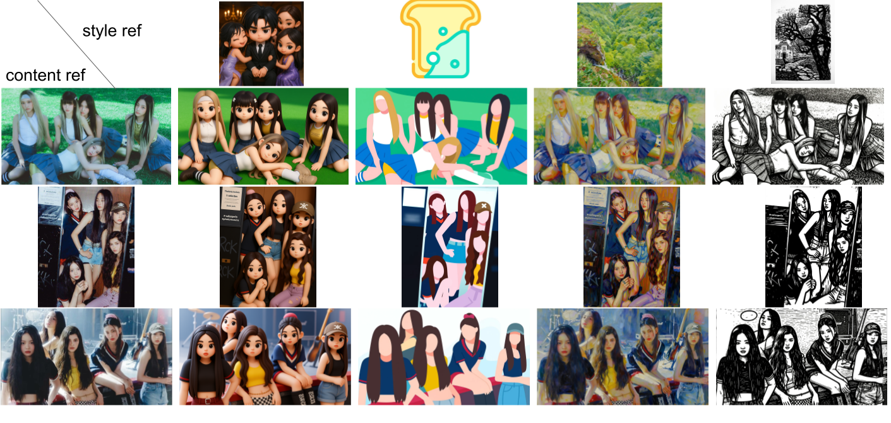

# QwenStyle: Content-Preserving Style Transfer with Qwen-Image-Edit

For the first time, we introduce  Content-Preserving Style Transfer functionality to Qwen-Image-Edit, which supports transferring various style cues from style reference to content reference while preserving the characteristics of content reference in high efficiency, i.e. 4 sampling steps. 

Please try our free online [demo](https://huggingface.co/spaces/witcherderivia/QwenStyle). If you encounter an error with the demo after generation, the reason is very likely that ZeroGPU is out-of-memory. So the solution is to just decrease the min edge (I have provided this parameter in the UI) from the default 1024 to 832 or lower. This is because HF ZeroGPU only has 70GB memory, and my dev H100 GPU has 80GB and could run these examples with a min edge of 1024 without any problem.

Please note that our style transfer model is based on [Qwen-Image-Edit-2509](https://huggingface.co/Qwen/Qwen-Image-Edit-2509), and has to be used with [Qwen-Image-Lightning Lora](https://huggingface.co/lightx2v/Qwen-Image-Lightning), which we have converted to Diffsynth format for compatibility.  Otherwise, the model may suffer from either low-speed or low-quality. 




## Quick Start


Install DiffSynth
```
git clone https://github.com/modelscope/DiffSynth-Studio.git  
cd DiffSynth-Studio
pip install -e .
```

Please download our style transfer lora and lightning lora from [this link](https://huggingface.co/witcherderivia/Qwen-Image-Style-Transfer/)

Then run infer_style_transfer.py for inference. We have tested the model on one H100, which takes 5 seconds to generate the result.


## Training

Our training framework is based on [DiffSynth-Studio](https://github.com/modelscope/DiffSynth-Studio). Special thanks to the authors of DiffSynth.

## Data

We will open-source all our training data if the stars exceed 200. 


## Citation

We release the tech report of [QwenStyle V1](https://openreview.net/forum?id=Cgb7JpOA5Q&referrer=%5Bthe%20profile%20of%20Shiwen%20Zhang%5D(%2Fprofile%3Fid%3D~Shiwen_Zhang1)). We are  refining QwenStyle and will update new versions in the future.  Please light a star for our project and  cite our work if you find it helpful.

```bibtex
@article{zhang2026qwenstyle,
  title={QwenStyle: Content-Preserving Style Transfer with Qwen-Image-Edit},
  author={Zhang, Shiwen and Huang, Haibin and Zhang, Chi and Li, Xuelong},
  journal={TeleAI},
  year={2026}
}
```
